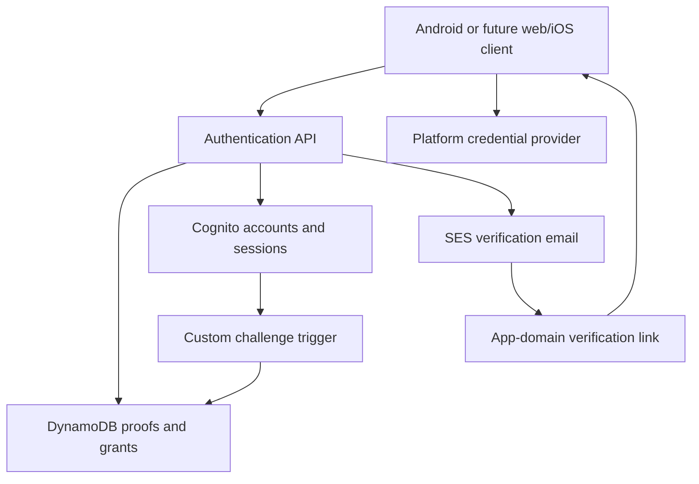

# Attestra system architecture

This repository owns the design of the complete system. See [documentation ownership](DOCUMENTATION.md) for the boundary between system decisions and implementation guidance.

## Components and trust boundaries

| Component | Responsibility | Implementation guide |
| --- | --- | --- |
| Android client | User interface, protected pending/session state, email link routing, native passkey operations, and optional identity-capture handoff | [Android auth](https://github.com/lambdawalker/android.attestra.auth) |
| Authentication API | Validate email proofs, enforce transaction/retry policy, orchestrate Cognito, and expose registration/sign-in/session operations | [Go auth](https://github.com/lambdawalker/go.attestra.aws.auth) |
| DynamoDB proof store | Atomic transaction claims, expiry checks, rate budgets, and one-use session grants | [Email AWS design](auth/onboarding/email-confirmation/aws.md) |
| SES | Deliver the application-owned verification email | [Backend operations](https://github.com/lambdawalker/go.attestra.aws.auth#deployment) |
| Cognito | Stable account identity, session issuance and refresh, email OTP challenges, and public passkey credential registry | [Login](auth/login/architecture.md) and [passkey AWS design](auth/onboarding/passkey-creation/aws.md) |
| Web/iOS clients | Future platform implementations of the same user journeys; host association and link handling belong to their respective platforms | Not provided by these three repositories |
| Identity/address verification | Separate evidence, automated reports, provider decisions, and assurance policy | [Identity](verification/identity/architecture.md) and [address](verification/address/architecture.md) |

The API origin and application link origin are different boundaries. The API serves POST operations; the application domain owns `/verify-email`, client UI, and platform association files. A GET/HEAD link fetch cannot confirm an account. The backend's Pulumi stack does not deploy the web client or domain association files.

The client never supplies its own Cognito grant. After the backend accepts a single-use application proof, Cognito's custom challenge validates a server-created grant before issuing tokens. The successful confirming client alone receives the session. Native credential providers retain private passkey keys; Cognito verifies registration/assertions and stores credential records. Email confirmation, session authentication, passkey enrollment, and identity/address assurance are independent states.

## Canonical journeys

- [Onboarding architecture](auth/onboarding/architecture.md): proof protocol, cross-feature transitions, security requirements, and acceptance criteria.
- [Email confirmation](auth/onboarding/email-confirmation/README.md): detailed subflow, UI, and AWS boundaries.
- [Passkey creation](auth/onboarding/passkey-creation/README.md): authenticated enrollment and cancellation/retry behavior.
- [Login](auth/login/architecture.md): passkey authentication with email OTP recovery.
- [Returning users](auth/onboarding/resume.md): refreshing sessions, unfinished signup, and welcome after ID deferral.
- [ID capture](auth/onboarding/id-capture/README.md): proposed plugin/evidence integration; capture or email confirmation never proves identity.

## Identity-provider limitation

The application offers passkeys and email OTP, not a password UI. The current Cognito configuration also allows `PASSWORD`, so it does not guarantee that password authentication is impossible at the provider level if an account acquires a password. A requirement to prohibit that path needs a separate architecture decision. The [backend deployment gotcha](https://github.com/lambdawalker/go.attestra.aws.auth#configure-the-android-api-url) records the concrete provider constraint and operational implications.

## Implementation versus readiness

The reviewed Go and Android sources include email confirmation, registration, sign-in, refresh, and passkey status. Android also has an ID-deferral welcome screen. ID capture/provider integration and complete web/iOS clients remain separate work. Local source support does not certify cloud deployment, domain association, or live end-to-end behavior; each module owns its verification and deployment instructions.
