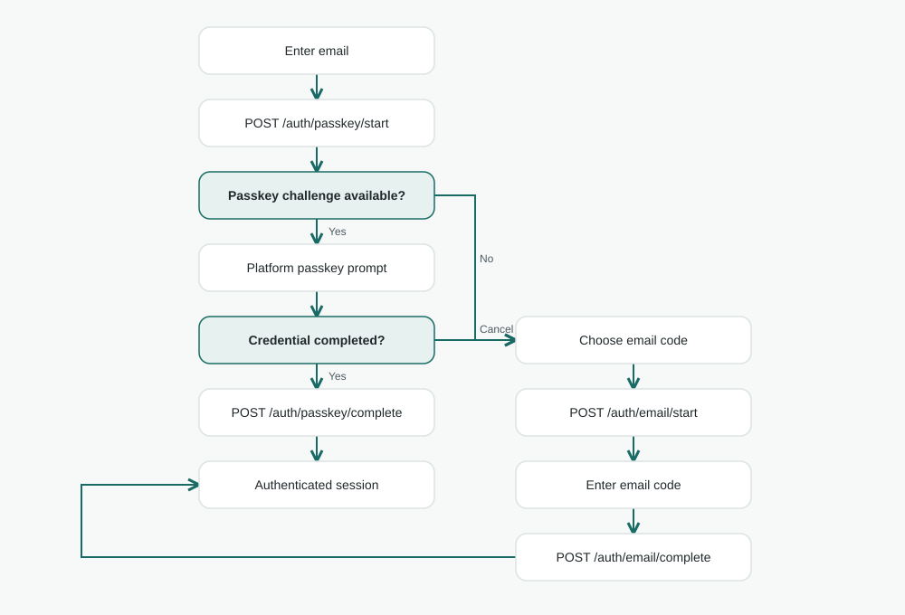
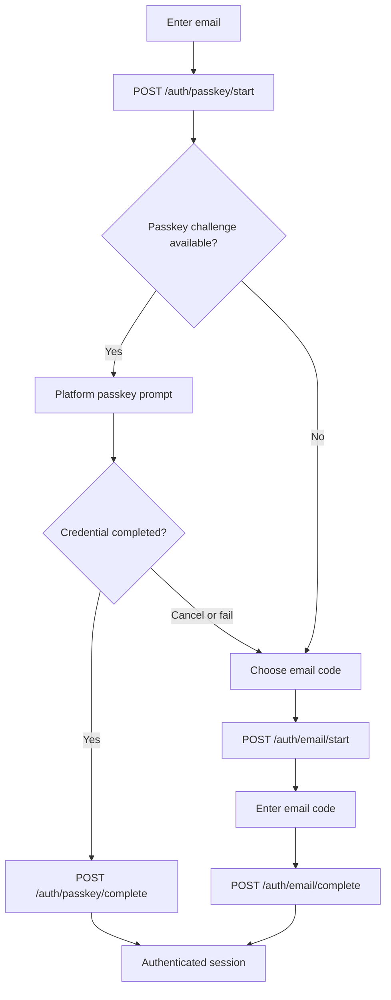

# Authentication / login architecture

**Status:** Go API endpoints implemented in [go.onboarding](https://github.com/lambdawalker/go.onboarding/pull/1); website/native clients still need a login UI and platform credential adapters. [Shared visual system](../DESIGN.md) · [Stitch screen spec](stitch.md) · [API reference in the implementation branch](https://github.com/lambdawalker/go.onboarding/blob/feat/aws-onboarding/README.md#api).

## Scope

The user enters an email and attempts a passkey sign-in first. Email OTP is the fallback when a passkey cannot be used, is lost, or has not yet been registered. This stack enables `USER_AUTH` with `WEB_AUTHN` and `EMAIL_OTP`; it does not define a password login or Cognito-hosted UI. A login grants an authenticated session, not identity or address assurance.

## Endpoint contract

| Step | Request | Response/use |
| --- | --- | --- |
| Begin passkey | `POST /auth/passkey/start` `{ "email": "..." }` | Cognito `Session` and challenge parameters; platform converts `CREDENTIAL_REQUEST_OPTIONS` for WebAuthn/Credential Manager |
| Complete passkey | `POST /auth/passkey/complete` `{ "email": "...", "session": "...", "credential": {...} }` | Cognito token set on success |
| Begin fallback | `POST /auth/email/start` `{ "email": "..." }` | Sends Cognito email OTP and returns an opaque `session` |
| Complete fallback | `POST /auth/email/complete` `{ "email": "...", "code": "...", "session": "..." }` | Cognito token set on success |

The client keeps the opaque auth session only for its matching challenge. Never place that session, WebAuthn credential response, OTP, or returned tokens in navigation URLs or analytics. The website determines how to store the resulting session securely; the API's token response uses `Cache-Control: no-store`.

## Recovery and constraints

- A passkey prompt may be cancelled without treating the account as invalid. Return to the email entry state or offer **Use an email code instead**. Do not imply that failure proves no account or no passkey exists.
- If an email OTP code or Cognito challenge session expires, offer a fresh start. Show stable API error copy for `code_expired`, `code_mismatch`, `rate_limited`, `delivery_failed`, `unauthorized`, and `unexpected_challenge` without raw Cognito details.
- The application should not disclose whether an email is registered in pre-authentication copy. Cognito client configuration enables user-existence protection; product copy should not undo it.
- The platform owns passkey approval and user verification. The Go service forwards challenge data and the credential assertion to Cognito; it never receives or stores the passkey private key.
- Email OTP fallback is an account recovery path and a lower assurance factor than a device-bound passkey. Future sensitive actions can require a fresh passkey assertion or an independently defined step-up policy; successful OTP alone must not claim passkey possession.
- If onboarding confirmation succeeded but its automatic sign-in session expired, use this OTP path to resume passkey setup. Identity and address status are evaluated separately by feature policy.

## Outstanding client decisions

Decide whether web sessions will be converted to secure server cookies, how native tokens are stored and refreshed, which passkey cancellation cases should show fallback immediately, and which future features need recent reauthentication. None of those client policies is enforced by the current Go onboarding API.
