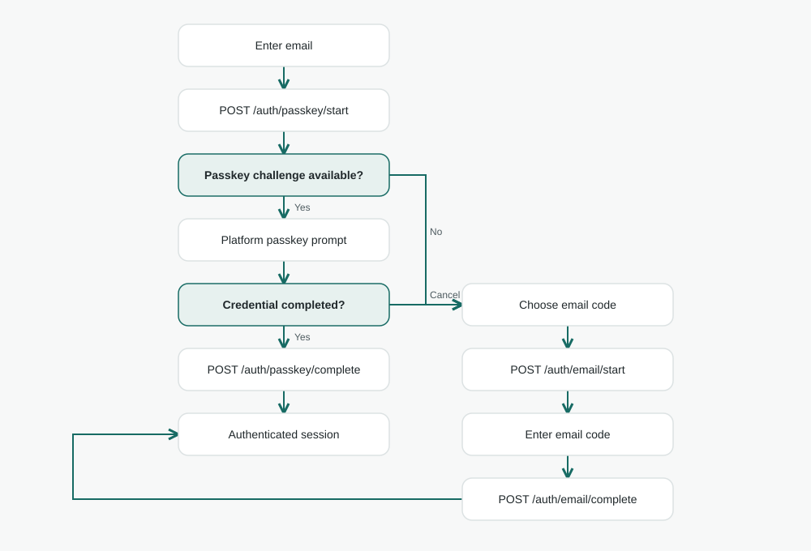
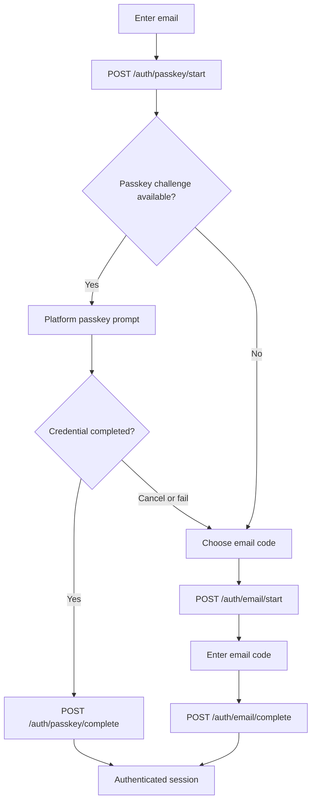

# Authentication / login architecture

**Status:** Email OTP and passkey sign-in, session refresh, and authenticated passkey status endpoints exist in the [Go backend](https://github.com/lambdawalker/go.attestra.aws.auth); the [Android client](https://github.com/lambdawalker/android.attestra.auth) provides their native UI and Credential Manager adapter. Web/iOS clients and deployed integration validation are separate work. [Shared visual system](../DESIGN.md) · [Stitch screen spec](stitch.md).

## Scope

The user enters an email and attempts a passkey sign-in first. Email OTP is the fallback when a passkey cannot be used, is lost, or has not yet been registered. The current pool supports `USER_AUTH` with `EMAIL_OTP` and `WEB_AUTHN`. It does not define a password login or Cognito-hosted UI. A login grants an authenticated session, not identity or address assurance.

```mermaid
flowchart TD
    A["Enter email"] --> B["POST /auth/passkey/start"]
    B --> C{"Passkey challenge available?"}
    C -->|Yes| D["Platform passkey prompt"]
    D --> E{"Credential completed?"}
    E -->|Yes| F["POST /auth/passkey/complete"]
    F --> G["Authenticated session"]
    C -->|No| H["Choose email code"]
    E -->|Cancel or fail| H
    H --> I["POST /auth/email/start"]
    I --> J["Enter email code"]
    J --> K["POST /auth/email/complete"]
    K --> G
```

## Authentication operations

| Step | Operation | Responsibility |
| --- | --- | --- |
| Begin passkey | `/auth/passkey/start` | Obtain a challenge for the platform credential provider |
| Complete passkey | `/auth/passkey/complete` | Validate the assertion and establish an authenticated session |
| Begin fallback | `/auth/email/start` | Issue a fresh Cognito email OTP challenge |
| Complete fallback | `/auth/email/complete` | Validate the OTP for that challenge and establish a session |

Exact request/response shapes and error codes are maintained in the [backend HTTP reference](https://github.com/lambdawalker/go.attestra.aws.auth/blob/main/README.md#return-to-onboarding-and-sign-in).

The client keeps the opaque auth session only for its matching challenge. Never place that session, WebAuthn credential response, OTP, or returned tokens in navigation URLs or analytics. The website determines how to store the resulting session securely; the API's token response uses `Cache-Control: no-store`.

## Recovery and constraints

- A passkey prompt may be cancelled without treating the account as invalid. Return to the email entry state or offer **Use an email code instead**. Do not imply that failure proves no account or no passkey exists.
- If an email OTP code or Cognito challenge session expires, offer a fresh start. Show safe failure and retry copy without raw Cognito details. Current transport error names are documented in the [backend API reference](https://github.com/lambdawalker/go.attestra.aws.auth/blob/main/README.md#return-to-onboarding-and-sign-in); do not assume a provider-specific error is exposed.
- The application should not disclose whether an email is registered in pre-authentication copy. Cognito client configuration enables user-existence protection; product copy should not undo it.
- The platform owns passkey approval and user verification. The Go service forwards challenge data and the credential assertion to Cognito; it never receives or stores the passkey private key.
- Email OTP fallback is an account recovery path and a lower assurance factor than a device-bound passkey. Future sensitive actions can require a fresh passkey assertion or an independently defined step-up policy; successful OTP alone must not claim passkey possession.
- If onboarding confirmation succeeded but its automatic sign-in session expired, use this OTP path to resume passkey setup. Identity and address status are evaluated separately by feature policy.

## Outstanding client decisions

Web session storage/cookies, iOS token storage, and future step-up policies remain design decisions. Android uses platform-protected token storage and refreshes sessions before checking authenticated passkey status; see [returning users and session recovery](../onboarding/resume.md). Deployment and client-specific configuration belong in the implementation repositories.
