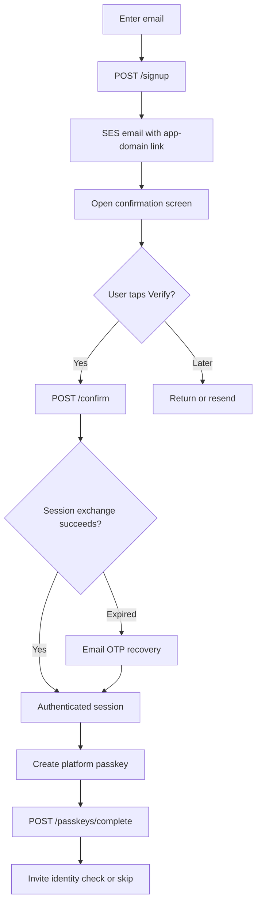

# Authentication / onboarding architecture

**Status:** Backend implemented in [go.onboarding](https://github.com/lambdawalker/go.onboarding/pull/1) using Go and Pulumi; application screens, deep-link association, and platform passkey adapters remain integration work. [Shared visual system](../DESIGN.md) · [Stitch screen spec](stitch.md) · [API reference in the implementation branch](https://github.com/lambdawalker/go.onboarding/blob/feat/aws-onboarding/README.md#api).

## Goal and boundaries

Create an account by verifying an email address and then registering a passkey. Let the user reach an authenticated session from the original email proof without asking for another OTP. The app and website own every visible screen; Cognito does not host the UI. Onboarding completion means email confirmed and passkey registered. It never implies identity or address verification.

| Responsibility | Owner |
| --- | --- |
| Signup, code validation, confirmation session, access/refresh tokens, WebAuthn credentials | Cognito User Pool |
| Email sending and sender identity | Cognito with a verified SES domain; Custom Message Go Lambda supplies the app-domain link |
| API orchestration and safe error codes | Go onboarding Lambda and HTTP API Gateway |
| HTTPS verification screen, user tap, passkey platform calls, session protection | Website and native applications |
| AWS infrastructure | Pulumi Go stack in [`go.onboarding/infra`](https://github.com/lambdawalker/go.onboarding/tree/feat/aws-onboarding/infra) |

## Flow

The SVG is a static rendering of the same steps below; GitHub also renders the Mermaid block directly.

1. `POST /signup` with an email creates an unconfirmed, passwordless Cognito account. Signup for an existing address responds with the same generic 202 as a new signup. The response does not guarantee an email was sent.
2. Cognito sends a confirmation code through SES. The Go Custom Message Lambda builds `https://<app-host>/verify-email?email=...&code=...`, retaining Cognito's literal code placeholder for substitution. It customizes signup and resend messages; authentication OTP emails use Cognito's configured behavior.
3. The HTTPS route opens a confirmation screen in the installed app through Android App Links/iOS Universal Links where associated, or on the website otherwise. **GET, link preview, prefetch, and page render do not confirm.** The screen offers an explicit **Verify email** action.
4. A deliberate tap sends `POST /confirm` with email and code. The backend calls `ConfirmSignUp`, then starts `USER_AUTH` with its returned `Session` and `USERNAME`. A successful exchange returns a Cognito token set without another email challenge.
5. A confirmed account whose session exchange cannot finish receives `409 confirmed_sign_in_required`. Start email OTP sign-in through [login](../login/architecture.md); do not replay `ConfirmSignUp` against an already confirmed account.
6. With the Cognito access token, call `POST /passkeys/options`, use browser WebAuthn or Android/iOS credential APIs to create a passkey for the configured RP ID, then submit the resulting registration JSON to `POST /passkeys/complete`. Show success only after that endpoint returns `registered: true`.
7. Offer a clear **Continue to identity verification** and **Skip for now**. Skipping preserves the authenticated account and does not alter identity/address assurance. Feature-specific gates can invite continuation later.

## Recovery and edge cases

| Situation | Client behavior |
| --- | --- |
| Expired confirmation code (`code_expired`) | Explain expiry and offer `POST /resend` |
| Incorrect code (`code_mismatch`) | Keep the email, allow correction; rate limit repeats |
| Throttled (`rate_limited`) or delivery failed (`delivery_failed`) | Give a retry path and avoid promising delivery |
| Link opens on a different device | The confirming device receives the new session; no session or token is placed in the link |
| Link opened by a scanner | Nothing is consumed until explicit `POST /confirm` |
| Email confirmed, passkey cancelled or device unsupported | Keep the account confirmed; use email OTP login later to resume enrollment |
| Duplicate signup or unknown address during resend | Show a neutral delivery status to avoid revealing account existence |

## Security and integration requirements

- Deliver the link over HTTPS on the configured app domain. Publish Android and iOS association files for the deep-link host and appropriate association files for the WebAuthn RP ID. A subdomain and its parent RP ID are distinct association targets.
- Treat URL codes as sensitive. Avoid third-party assets/analytics on the confirmation screen, strip the query from subsequent navigation, set a restrictive referrer policy, and do not log raw URLs.
- The Go API returns tokens as JSON with `Cache-Control: no-store`. The website needs a secure session strategy (for example a backend session with Secure, HttpOnly, SameSite cookies); native clients should use platform-protected credential storage. Tokens never enter email links.
- Keep signup, email confirmation, passkey registration, and later identity/address decisions as distinct facts. Cognito `sub` is the stable account identifier for future verification records.
- The backend and Pulumi stack exist in `go.onboarding`, but production DNS, SES verification, AWS deployment, mobile association files, and live end-to-end verification are still outstanding.
