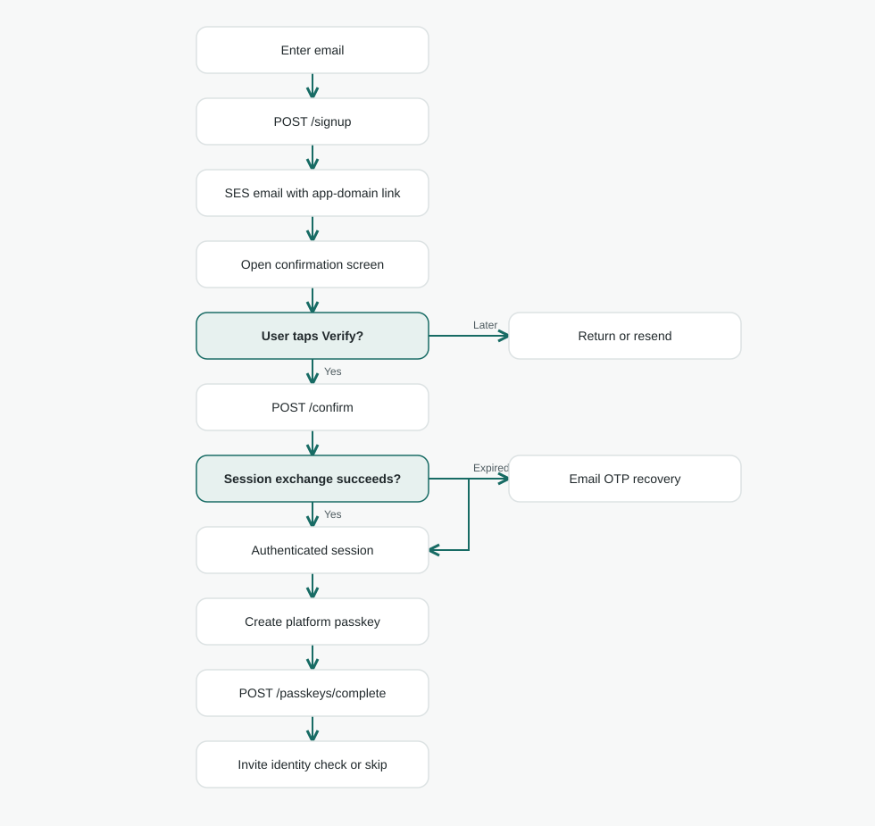

# Authentication / onboarding architecture

**Status:** Design revision for automatic A+B confirmation and manual B+C confirmation. The existing [Go backend draft](https://github.com/lambdawalker/go.onboarding/pull/1) implements the earlier email/code flow; the three-token protocol below, email generation, transaction storage, and client branching still require implementation. [Shared visual system](../DESIGN.md) · [Stitch screen spec](stitch.md) · [Current implementation API](https://github.com/lambdawalker/go.onboarding/blob/feat/aws-onboarding/README.md#api).

## Goal and boundaries

Create an account by verifying an email address and then registering a passkey. When the email link opens in the client that started signup, confirm automatically and advance to passkey setup. When the original client secret is unavailable, ask for the code displayed in that same email and confirm after the user submits it. Do not send a second email challenge on either successful path.

The app and website own every visible screen; Cognito does not host the UI. Onboarding completion means email confirmed and passkey registered. It never implies identity or address verification.

| Responsibility | Owner |
| --- | --- |
| Account state, authentication session, access/refresh tokens, WebAuthn credentials | Cognito User Pool |
| A+B / B+C proof validation, transaction expiry, retry limits, single use, and Cognito orchestration | Go onboarding backend and transaction store |
| Independent B and C generation and email composition | Backend email integration using the verified SES sender |
| Generate and retain A, route the email link, automatic confirmation or code-entry fallback | Website and native applications |
| Passkey platform calls and session protection | Website and native applications |
| AWS infrastructure | Pulumi Go stack in [go.onboarding/infra](https://github.com/lambdawalker/go.onboarding/tree/feat/aws-onboarding/infra) |

## Tokens and transaction binding

| Value | Created by | Stored or delivered where | Purpose |
| --- | --- | --- | --- |
| A: client secret | Client, using a cryptographically secure generator | Retained only in the initiating client until confirmation; never emailed or placed in URLs | Proves possession of the original signup context |
| A challenge | Client: base64url(SHA256(A)), using S256 semantics | Sent at signup and retained by the backend | Lets the backend check A without receiving A at signup |
| B: link token | Backend, independently of A and C | Email HTTPS link; backend stores a hash | Identifies and proves possession of the specific email link |
| C: manual code | Backend, independently of A and B | Displayed as text in the email, outside the link; user enters it on the fallback screen | Allows confirmation when A is unavailable |
| request_id | Backend | Returned to the initiating client and included in the email link | Non-secret handle to locate the matching locally stored A |

Generate A and B with at least 256 bits of cryptographic randomness. For C, use a cryptographically generated eight-digit decimal string, preserving leading zeros. Store a keyed digest of C scoped to its transaction; its short code space makes an ordinary unkeyed hash insufficient protection against offline guessing.

Bind the normalized email, request_id, A challenge, B hash, C digest, expiry, resend generation, attempt counters, and state to one transaction. Accept **B plus exactly one of A or C** for that transaction. Reject mixed, missing, mismatched, expired, replaced, or reused proofs. The backend determines the account from the transaction, never from a client-supplied email in the final confirmation.

C must not appear in the link, redirect parameters, page HTML, or any response obtainable with B alone. The fallback screen starts with an empty code field. Token names A, B, and C are implementation vocabulary and never appear in user-facing copy.

## Flow

The [Mermaid source](onboarding-flow.md) is kept separately from this page. The SVG below renders the same flow.

1. The client generates A and sends the email, A challenge, and S256 method to `POST /signup`. Retain A in local pending state; associate it with request_id when the response arrives. Signup creates an unconfirmed, passwordless account where appropriate. New and existing addresses receive the same generic 202 response shape with an opaque request_id; this does not guarantee an email was sent. Signup must never become a sign-in shortcut for an already confirmed account.
2. For an eligible pending account, the backend creates B and C and sends one email containing both a link and a separately displayed code. The link is `https://<app-host>/verify-email?request_id=...&b=...`. Neither A nor C is in the URL.
3. Android App Links/iOS Universal Links route to the installed app where associated; otherwise the website handles the route. **GET and HEAD never confirm or consume anything.** After the client loads, it looks up A for this request_id.
4. If matching local A exists, show “Verifying your email…” and automatically send `POST /confirm` with B and A. No confirmation button is required on this path. A's local presence only selects the path; the backend still validates the proof.
5. If A is unavailable, show an empty “Verification code” field and a **Verify email** button. The user enters C from the email; submission sends B and C. Paste and platform autofill may fill the field, but must not submit it automatically.
6. Both paths validate their proofs before changing Cognito state. A successful confirmation obtains an authenticated session and advances directly to **Create passkey**. Only the client that completed proof receives the session; the original client cannot obtain it merely by polling request_id.
7. If email confirmation succeeds but session exchange fails or expires, return `409 confirmed_sign_in_required` and start email OTP recovery through [login](../login/architecture.md). Do not replay confirmation or reopen the consumed transaction.
8. With the access token, call `POST /passkeys/options`, use browser WebAuthn or Android/iOS credential APIs, then submit registration JSON to `POST /passkeys/complete`. Keep the **Create passkey** action for the platform prompt; automatic email confirmation does not automatically create a passkey. Show success only after `registered: true`.
9. Offer **Continue to identity verification** and **Skip for now**. Skipping preserves the authenticated account and does not change identity/address assurance.

## Proposed API changes

These request shapes are design targets, not claims about the current Go implementation.

| Endpoint | Request | Behavior |
| --- | --- | --- |
| `POST /signup` | `{email, code_challenge, code_challenge_method: "S256"}` | Generic 202 with request_id; eligible pending signup receives an email containing link B and code C |
| `POST /confirm` automatic | `{request_id, token_b, token_a}` | Validate A+B for this transaction, confirm, and return the session |
| `POST /confirm` manual | `{request_id, token_b, token_c}` | Validate B+C for this transaction, confirm, and return the session |
| `POST /resend` | `{request_id}` | Generic 202; for an eligible pending transaction rotate B and C together and send a replacement email |

Resend retains request_id and its A challenge, so the initiating client can use its existing A with the new B. A new signup creates a separate request_id; never replace a challenge based only on an email match. Resend invalidates the previous B and C together. A limited resend policy must prevent unlimited code guesses or indefinite transaction renewal.

## Recovery and edge cases

| Situation | Client and backend behavior |
| --- | --- |
| Different browser, device, isolated email browser, or cleared local storage | A is missing: show code entry and submit B+C; the confirming client receives the session |
| A exists but belongs to another transaction or fails validation | No confirmation or consumption; discard the stale association and offer manual code entry without an automatic retry loop |
| Scanner opens B without A | Render the empty manual form; B alone cannot confirm, consume the transaction, or spend C guesses |
| Incorrect C | Keep the form and B, show a safe mismatch error; increment the manual attempt counter |
| Manual attempts exhausted | Disable further B+C attempts for that generation and offer a throttled resend; a valid A+B proof may still succeed |
| Expired or replaced B/C | Explain that the link/code is no longer usable; resend when eligible and use the newest email |
| Missing or malformed B | Show an invalid-link state and request a new email; C alone is insufficient |
| Concurrent A+B and B+C submissions | At most one confirmation/session issuance wins; the other receives an in-progress or already-used result without another token set |
| Network failure or reload | Avoid parallel/repeated submits; use the server outcome, and if confirmation completed without a recoverable session, use email OTP recovery |
| Email confirmed, passkey cancelled or unsupported | Keep email confirmed and allow email OTP login later to resume enrollment |
| Duplicate signup, unknown resend, throttling, or delivery failure | Preserve neutral account-existence copy and expose only safe retry/delivery status |
| Email link opened again after completion | Continue only if this client already has the matching authenticated session; otherwise offer sign-in |

## Security and integration requirements

- The backend accepts A+B or B+C, never B alone. Validate expiry and the bound transaction before any Cognito confirmation or session exchange. Remove or migrate the earlier `{email, code}` shortcut so it cannot bypass this rule.
- Use a ten-minute validity window for each delivered B/C generation and at most five incorrect C submissions per generation as initial policy. Enforce resend/account/source throttles across generations; invalid or absent A/B requests must not consume proofs or increment C's guess counter.
- Make both paths share a transaction state machine with an atomic claim before provider side effects. Track confirmation and session issuance separately so races, crashes, and retries cannot mint sessions twice or turn a confirmed account back into a pending one.
- B and C are application proofs. Do not expose a Cognito confirmation code as B or C or allow a publicly callable Cognito path to bypass application proof validation. The implementation must choose and validate a server-controlled Cognito confirmation/session strategy; do not assume that the existing Custom Message Lambda can simply provide this protocol. Preserve `ConfirmSignUp` followed by `USER_AUTH` with its returned Session only where that integration remains valid, otherwise use an explicitly designed session bridge. Administrative confirmation alone is not a substitute for an authenticated session.
- A standard remote link fetch lacks A and sees no C on the page. **This protects against ordinary link prefetching, not an email provider or scanner that reads C from the full message and submits B+C.** B and C are in the same email and are not independent authentication factors. A preview operating in the original client's storage context may also complete A+B; this flow is email verification, not proof of a deliberate tap or document-signing consent.
- Web storage for A must survive an email opening a new tab on the intended origin; tab-scoped sessionStorage alone is insufficient. Keep A per request, short-lived, and protected against script injection. A server-backed pending browser session is another option. Native apps retain A in platform-protected pending storage. Clear A when completed or expired.
- Serve the link over HTTPS on the app domain and publish the Android/iOS associations for the link host and WebAuthn RP ID. Keep redirects fixed or allowlisted. Never transfer A through a URL to work around browser isolation.
- Treat all proof values as secrets. Avoid third-party assets/analytics on the landing screen; redact proof fields and raw URLs in logs, set a restrictive referrer policy, strip B from the address bar after capturing it, and use `Cache-Control: no-store`. Preserve B only in bounded pending client state if navigation/reload recovery needs it.
- Return session tokens only to the successful confirming client. Use protected native storage or secure web sessions, with CSRF protection where cookies authenticate requests. Access/refresh tokens never enter email links or browser navigation.
- Keep signup, email confirmation, passkey registration, and identity/address decisions separate. Cognito `sub` remains the stable account identifier.
- The earlier Go backend and Pulumi stack are the baseline. Implement this transaction protocol and email integration, then complete deployment, DNS/SES setup, mobile associations, and live end-to-end verification.

## Acceptance checks for implementation

1. A matching A+B confirms automatically and opens passkey setup without an extra Verify button.
2. Missing A presents an empty C field; valid B+C confirms only after submission and opens the same next step.
3. Fetching the email link or submitting B alone has no confirmation, consumption, or session side effect.
4. Swapping A, B, C, or request_id between two transactions never succeeds; wrong A does not exhaust manual attempts.
5. The email link and landing responses never contain C; signup/resend responses never expose B or C.
6. Expiry, leading-zero C values, five failed manual attempts, resend rotation, throttling, duplicate requests, and concurrent paths behave as specified.
7. Two tabs in one browser, separate browser profiles, app-to-browser fallback, and another device exercise the expected automatic/manual branches.
8. Cognito failure and partial confirmation recover without a bypass, replayed confirmation, or duplicate session issuance.
