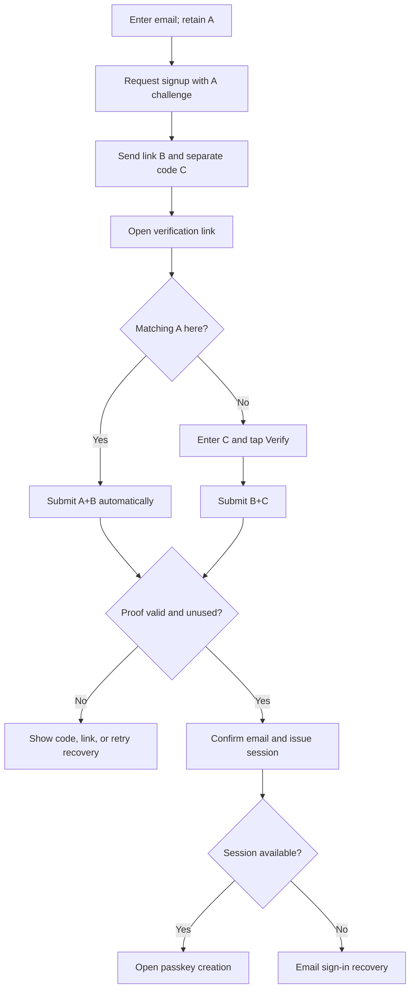

# Email confirmation subflow

This diagram expands the email portion of the [overall onboarding flow](../onboarding-flow.md). A, B, and C are internal proof names; the UI never displays them. A is retained by the initiating client, B is in the link, and six-digit C appears separately in the same email.

Opening the link with GET or HEAD has no confirmation side effect. A link scanner without A sees only the manual-entry screen; B alone cannot spend C attempts. An email processor that reads both B and C from the message is outside this protection. Only the client that submits a valid proof can receive the session. See [architecture](architecture.md) for atomic state and recovery rules.
