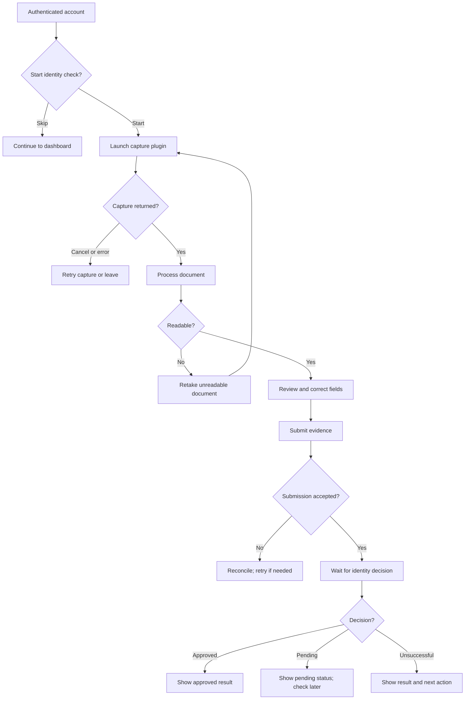

# ID capture subflow

This expands the optional identity branch of the [overall onboarding flow](../onboarding-flow.md). Camera capture belongs to the selected plugin; the application owns the surrounding screens and recorded decisions.

An accepted upload or readable document does not mean identity approval. The separate automated report and external provider decision follow the [identity architecture](../../../verification/identity/architecture.md). “Unsuccessful” needs a dedicated screen and policy-specific retry or support action; see [UI](ui.md).
