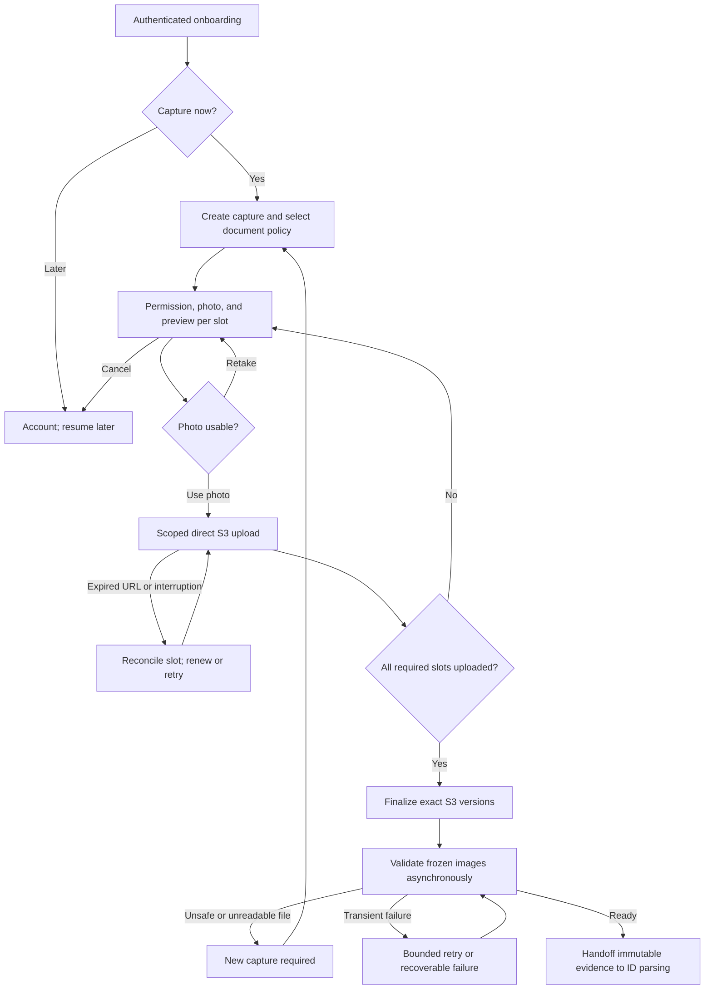

# ID capture flow

[Architecture](architecture.md) · [Parsing handoff](../id-parsing/flow.md)

```mermaid
flowchart TD
    A["Authenticated onboarding"] --> B{"Capture now?"}
    B -->|Later| Z["Account; resume later"]
    B -->|Yes| C["Create capture and select document policy"]
    C --> D["Permission, photo, and preview per slot"]
    D -->|Cancel| Z
    D --> E{"Photo usable?"}
    E -->|Retake| D
    E -->|Use photo| F["Scoped direct S3 upload"]
    F -->|Expired URL or interruption| R["Reconcile slot; renew or retry"]
    R --> F
    F --> G{"All required slots uploaded?"}
    G -->|No| D
    G -->|Yes| H["Finalize exact S3 versions"]
    H --> I["Validate frozen images asynchronously"]
    I -->|Unsafe or unreadable file| J["New capture required"]
    J --> C
    I -->|Transient failure| K["Bounded retry or recoverable failure"]
    K --> I
    I -->|Ready| P["Handoff immutable evidence to ID parsing"]
```

Closing the screen is not cancellation of server work. A status timeout does not authorize creation of another capture; reconcile by the saved ID/idempotency key first. A parsing outcome is not part of this capture state machine.
