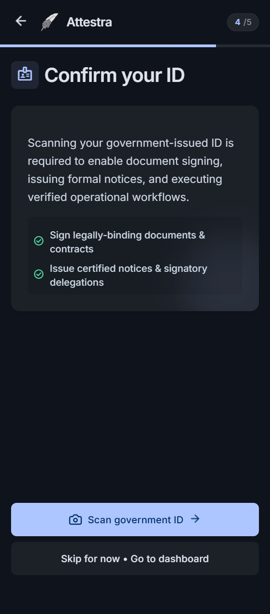

# Identity Verification Start

Screen ID: `identity_verification_start` · Parent flow: `onboarding.id-capture` · Capture kind: `design-prototype`.

Status: historical visual reference; normative behavior is in [the owning flow](../../ui.md). HTML does not establish backend or device implementation. Source reference: design main before this documentation update (`bea6831`). [Evidence ledger](../../../../../docs/compatibility.md).

## Entry, actions and exit

Entry: User elects optional document capture. Fields/actions: Start capture; defer/return to account.

Historical verification wording is not current capture copy. Fetch policy; permission/camera, preview and S3 upload follow.

Loading follows a real request; transport failure offers retry/cancel without fabricated success. Cancellation returns to the parent flow without completing it. Preserve focus after errors, accessible labels, keyboard navigation, large text, screen-reader status and reduced-motion behavior. Exact labels/appearance in [HTML source](code.html) are historical reference, not a substitute for these rules.

## Service and ownership

Read [the canonical contract](../../../id-evidence-contracts.md) and [backend integration](https://raw.githubusercontent.com/lambdawalker/go.attestra.aws.auth/main/docs/agents/api.md). Android owns device interaction; [its app and UI catalog](https://github.com/lambdawalker/android.attestra.auth) are the runnable implementation. These prototypes cannot prove that app renders this exact screen. Parsing/validation-specific behavior remains proposed.

## Evidence and missing states

Prototype JavaScript, external Tailwind/fonts and placeholder links are not a production service integration. Timed success transitions must not be copied into real authentication. Do not run this HTML in the docs origin with credentials. Use the flow's UI guide for missing error, recovery, permission, rotation and process-loss variants.

Original capture tool, viewport and source hash are unknown. Image may predate revised HTML wording; do not use it as visual acceptance evidence.
