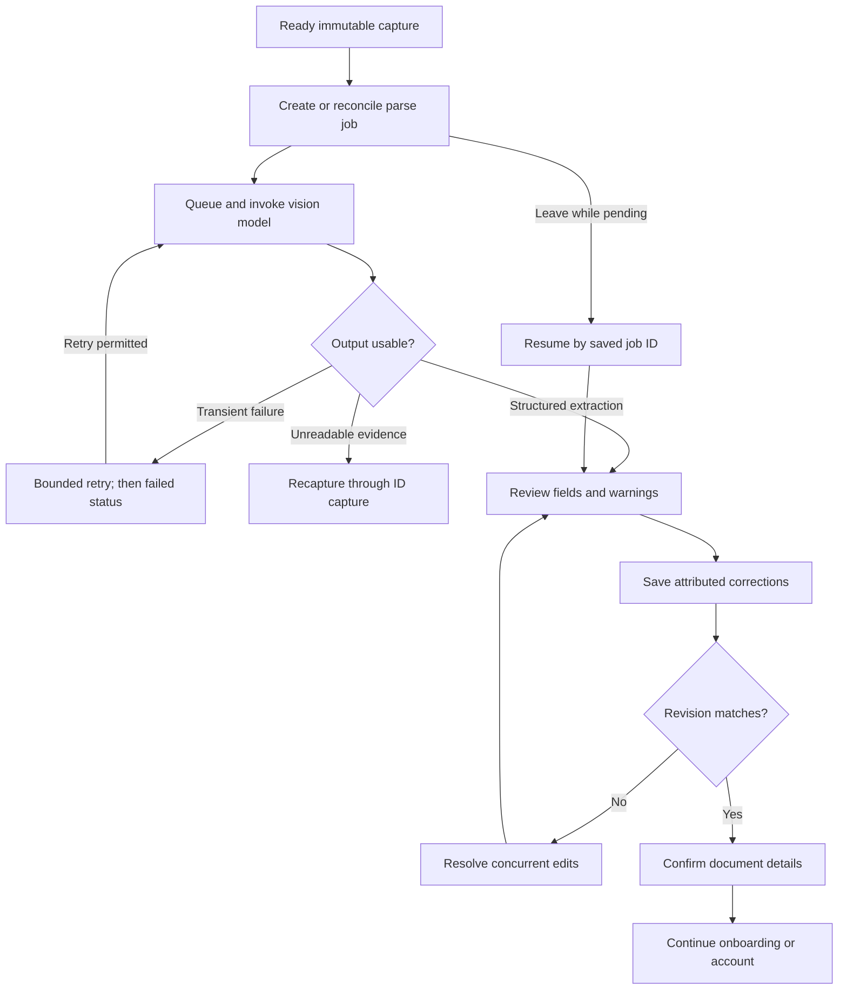

# ID parsing flow

Resume always retrieves current job status first; the diagram's resume-to-review edge applies only when extraction succeeded. A failed or pending job resumes its corresponding state. Confirming document details does not invoke ID validation or imply verified identity.
