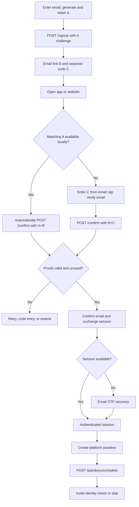

# Onboarding flow source

This Mermaid source corresponds to the [rendered SVG](onboarding-flow.svg) embedded in the [onboarding architecture](architecture.md). Update both representations when the flow changes.

