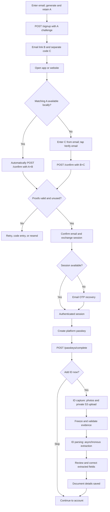

# Onboarding flow source

This is the current flow for the [onboarding architecture](architecture.md). The [legacy SVG](onboarding-flow.svg) is retained as a historical pre-split snapshot. Capture/parsing subflows have their own detailed diagrams.

```mermaid
flowchart TD
    S["Enter email; generate and retain A"] --> T["POST /signup with A challenge"]
    T --> M["Email link B and separate code C"]
    M --> L["Open app or website"]
    L --> D{"Matching A available locally?"}
    D -->|Yes| P["Automatically POST /confirm with A+B"]
    D -->|No| Q["Enter C from email; tap Verify email"]
    Q --> R["POST /confirm with B+C"]
    P --> V{"Proofs valid and unused?"}
    R --> V
    V -->|No| E["Retry, code entry, or resend"]
    V -->|Yes| F["Confirm email and exchange session"]
    F --> G{"Session available?"}
    G -->|No| O["Email OTP recovery"]
    G -->|Yes| H["Authenticated session"]
    O --> H
    H --> J["Create platform passkey"]
    J --> K["POST /passkeys/complete"]
    K --> N{"Add ID now?"}
    N -->|Skip| Z["Continue to account"]
    N -->|Yes| C1["ID capture: photos and private S3 upload"]
    C1 --> C2["Freeze and validate evidence"]
    C2 --> P1["ID parsing: asynchronous extraction"]
    P1 --> R1["Review and correct extracted fields"]
    R1 --> D1["Document details saved"]
    D1 --> Z
```
