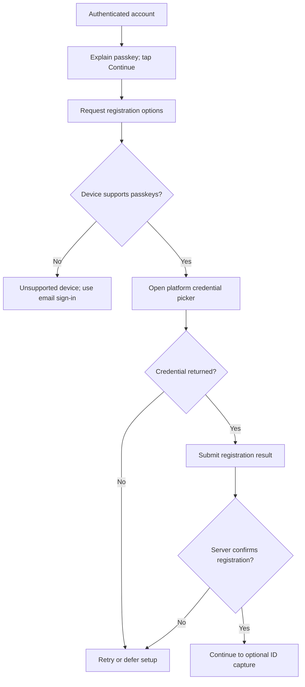

# Passkey creation subflow

This expands the passkey branch of the [overall onboarding flow](../onboarding-flow.md). A confirmed email and authenticated session are prerequisites.

Cancellation leaves email confirmed and passkey registration incomplete. The client shows success only after the registration completion response; neither opening the platform picker nor receiving a local credential proves server registration. See [architecture](architecture.md).
