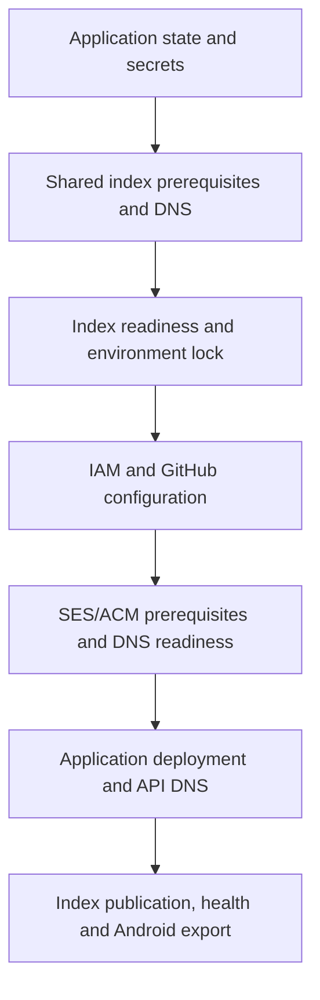

# Environment lifecycle and discovery

Status: implemented by the backend source at `64f4fae`; operational commands belong in [backend operations](https://github.com/lambdawalker/go.attestra.aws.auth/blob/main/docs/agents/operations.md). This page owns the cross-component boundaries and lifecycle decisions.

Each environment has independent application state, public API identity, Cognito identifiers and sender domain. Naming uses `<env>.<base-domain>` for app links, `<env>.api.<base-domain>` for the API, and `<env>.info.<base-domain>` for email. App hosting and platform association files remain separate responsibilities.

Setup must create SES identities and ACM certificates before their DNS records exist, then wait for authoritative readiness before deploying dependents. Cloudflare and Route 53 are alternative DNS owners. State bucket creation precedes Pulumi stack initialization. The shared index is its own `infra-index` project/`shared` stack and account/region state bucket. Application projects do not own its lifetime.

Independent environment rows allow dev and QA updates without rewriting one whole index file. Conditional writes and receipt revisions prevent stale publication. The shared index offers public reads and AWS IAM/SigV4 writes scoped to an environment. Authorization proves permission, not deployment provenance. Publication includes only allowlisted public client configuration; it must exclude credentials, evidence locations and identity data. Configuration hashes are not source commits or health attestations.

Normal environment teardown uses the same environment lock, retires its entry and verifies its own captured deletion scope. It retains shared index infrastructure. Dedicated shared-index teardown is allowed only after environment retirement and lock resolution; it removes shared AWS/DNS resources while preserving state/history. Operators must stop deployment writers during this operation. An S3 bootstrap lock and persistent pending marker prevent conflicting setup, but do not constitute a global transactional freeze of arbitrary AWS clients.

Interrupted work retains checkpoints and recovery receipts. A new setup lifecycle archives a completed teardown receipt; it must not bypass an unfinished teardown. Credential vaults are optional encrypted local convenience, separate from AWS session renewal. Final health checks and consolidated summaries distinguish completed, pending, retained and skipped work; they do not imply full product-journey validation.

The implementation currently uses a single AWS account/region per index. A future multi-account production model requires a designated registry account and explicit publication trust; reusing a DNS name across independently bootstrapped accounts is not supported.
