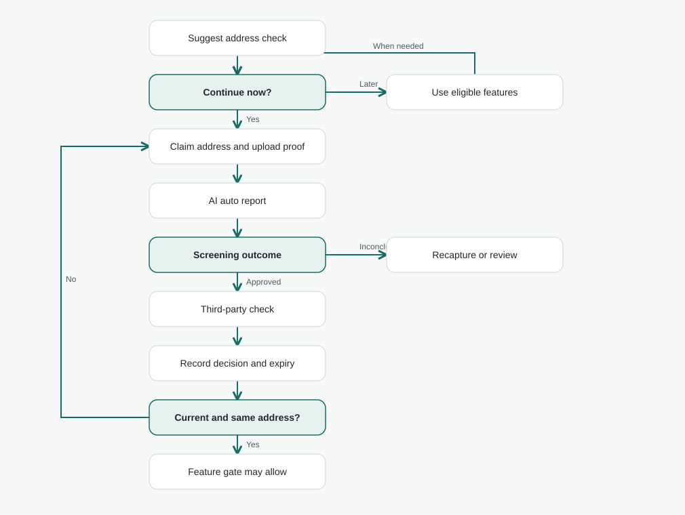
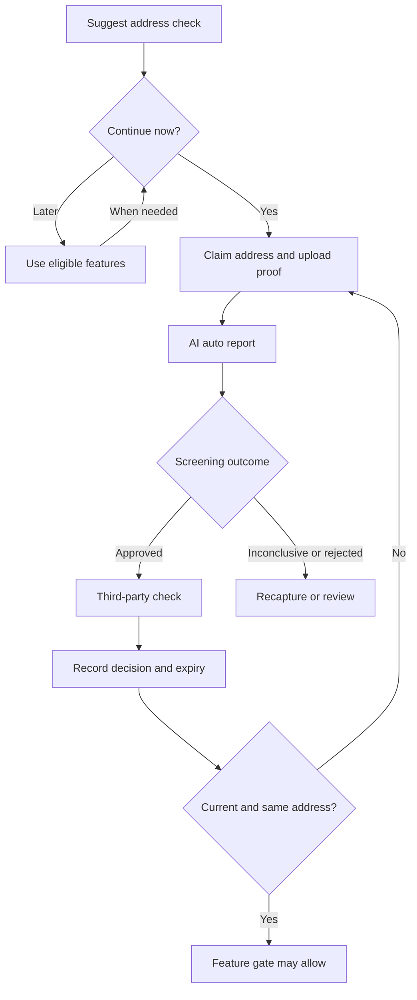

# Verification / address architecture

**Status:** Proposed architecture. The [new auth repository](https://github.com/lambdawalker/go.attestra.aws.auth) does not include bill upload, AI auto report, third-party check, expiry policy, or feature gate. [Documentation index](../../README.md) · [Identity check](../identity/architecture.md).

## Purpose

Suggest address verification after identity verification. Users can defer until a feature requires a current relationship with an address. A recent utility bill, such as gas or electricity, is a candidate proof, subject to an explicit accepted-document policy. An AI **auto report** and an independent **third-party check** have separate decisions. Address approval is tied to the claimed address and evidence version, and is time-limited.

## Evidence and decision model

1. Capture the claimed address and a suitable proof document. The report examines the document type, bill/service address, name, date, and any mismatch; the user can correct a claim but the original extraction remains recorded.
2. Store original evidence privately and associate each submission with an immutable address/evidence version. A change of claimed address starts a new assessment and cannot inherit approval from a different address.
3. Record the AI auto report with findings and outcome, separate from the provider's third-party result. Approved screening alone is not third-party verification.
4. Every time-limited approval includes `expiresAt`. For current-address feature gates, `now >= expiresAt` evaluates as expired while historical approvals remain unchanged. The gate checks the address and evidence version that the decision actually reviewed.

| Status slice | Values | Stored context |
| --- | --- | --- |
| `address.autoReport` | `not_started`, `pending`, `approved`, `rejected`, `inconclusive`, `error`, derived `expired` | Report ID, claimed address version, evidence version, findings, decidedAt, expiresAt if applicable |
| `address.thirdParty` | `not_started`, `pending`, `approved`, `rejected`, `inconclusive`, `error`, derived `expired` | Provider reference, address/evidence version, decision, decidedAt, expiresAt |

Compute expiry at read time, and preserve earlier decisions as history. A server-side feature gate reads current state rather than trusting a stale token claim. The address should never be called verified solely because the user typed it or uploaded a bill.

## Open decisions before implementation

- Which document types count as proof; how recent must they be; whose name may appear; what relationship to the address must the document establish?
- What does the selected third party validate, and what is the expiry window for each assurance level?
- Does an auto-report rejection block third-party submission or trigger recapture/review?
- How do changes in address or identity affect existing address approvals and user-facing history?
- What are consent, storage location, retention, deletion, and document access/audit requirements?
