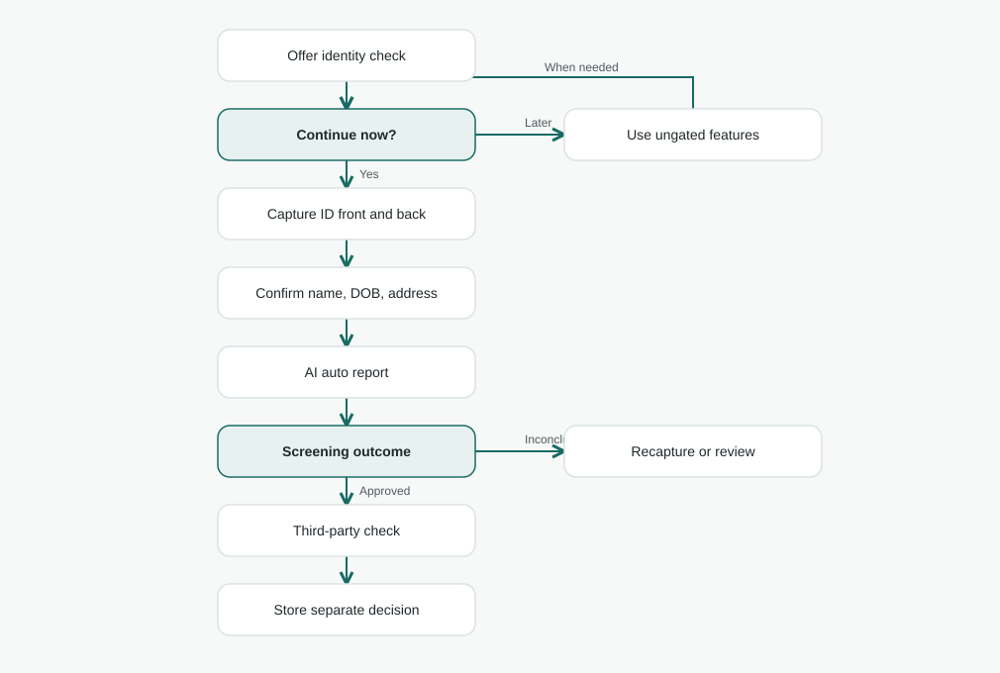
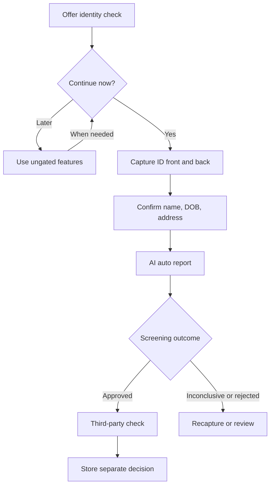

# Verification / identity architecture

**Status:** Proposed architecture. The [new auth repository](https://github.com/lambdawalker/go.attestra.aws.auth) does not include ID upload, AI auto report, third-party check, verification store, or feature gate. [Documentation index](../../README.md) · [Auth onboarding](../../auth/onboarding/architecture.md).

## Purpose

After email confirmation and passkey setup, invite the user to verify identity. They can skip and continue using features that do not require it. A gated feature resumes the check. The process has two independent outcomes: an AI-produced **auto report** to catch straightforward problems, and a **third-party check** that supplies a separately attributed decision. Passing the auto report does not imply third-party approval.

## Evidence and decision model

1. Collect front and back ID images under a defined document-type policy. The user reviews extracted name, date of birth, and address; store extracted values and corrections separately.
2. Place sensitive images in private object storage with scoped uploads, retention/deletion rules, and access logs. The authoritative record of verification state belongs in application-owned storage keyed by Cognito `sub`, not in Cognito attributes or tokens.
3. The AI auto report records its model/version, evidence version, findings, outcome (`pending`, `approved`, `rejected`, `inconclusive`, `error`), and timestamp. Its meaning is limited to screening.
4. The independent third-party check records provider reference, evidence version, findings/decision, and timestamp. It has its own outcome. Failed AI screening may trigger recapture or review; whether it blocks third-party submission is an open policy decision.
5. A resubmission creates a new evidence version. Retain prior submissions and outcomes for audit; never relabel an old approval as applying to new evidence automatically.

| Status slice | Values | Stored context |
| --- | --- | --- |
| `identity.autoReport` | `not_started`, `pending`, `approved`, `rejected`, `inconclusive`, `error` | Report ID, version, evidence version, findings, decidedAt |
| `identity.thirdParty` | `not_started`, `pending`, `approved`, `rejected`, `inconclusive`, `error` | Provider reference, evidence version, decision, decidedAt |

Feature authorization reads the current relevant status against a named policy. It never interprets a submitted document, a completed signup, or a passkey as an identity approval. Revocation or changed evidence must be reflected immediately by the server-side gate, regardless of a previously minted auth token.

## Open decisions before implementation

- Which IDs and jurisdictions are accepted, and which provider supports them? What does that provider's approval attest?
- Is selfie/liveness or another binding step needed to demonstrate that the ID belongs to the account holder?
- What are AI report input/output contracts, confidence and review thresholds, and recapture rules?
- Can users proceed to third-party checking after an inconclusive/rejected auto report? Who may override or manually review?
- Which features need auto report versus third-party approval; what happens after a name, address, or document change?
- What are consent, image retention/deletion, processing location, and audit requirements?
